# Smart Waste System     
 Garbage management is a project idea that is a self-manageable power by AI and the cloud. In this, we are different sensors to get the data from bins to push on the cloud and create a pipeline to get data ready for to AI model to train it on live data. Further, We transfer the idea to an algorithm that is based on A* has an additional parameter to get the shortest path to get work done with minimal energy wastage.  

Output :
After getting information about the bingoing to overflowing a self-manageable model will calculate the shortest path for the assigned vehicle to prevent wastage of fuel and overall process more efficient. I presume that this is a revolutionary idea going to help the municipal corporations to achieve all of this is maybe not achievable by the present system.

# Technology Used  

### Demo Images:
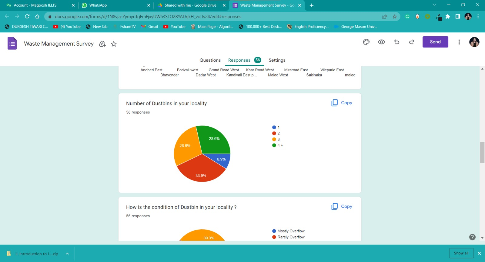
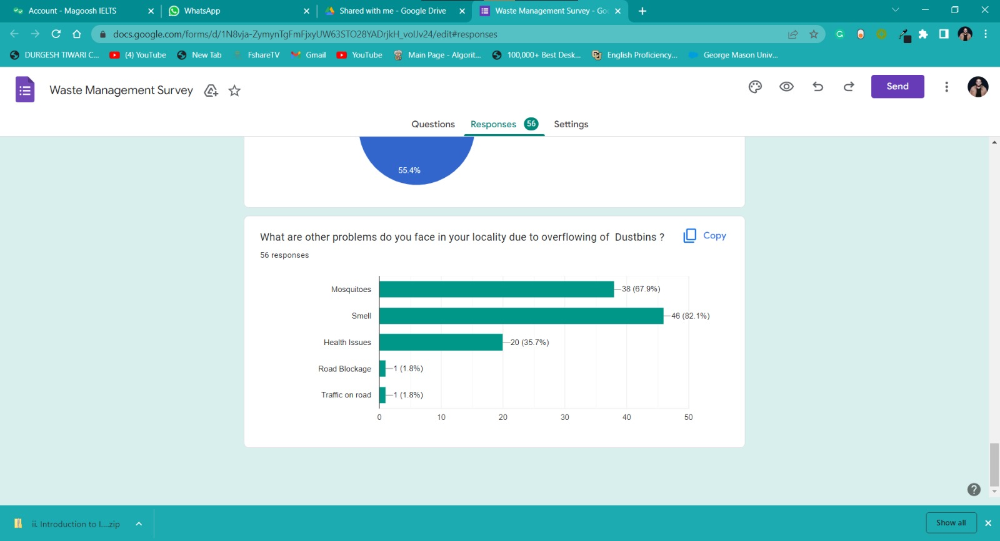

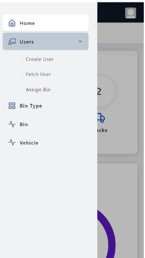
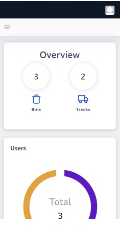
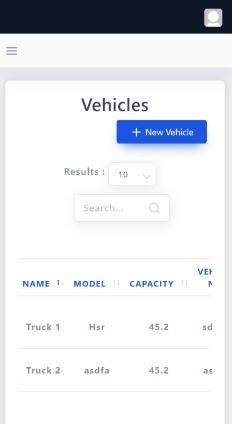
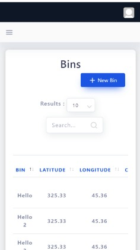
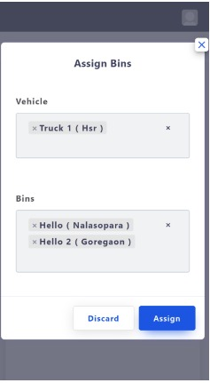
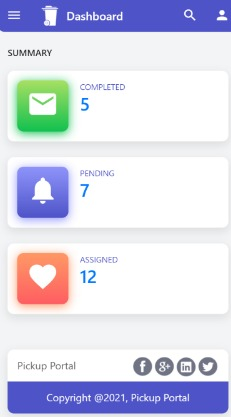
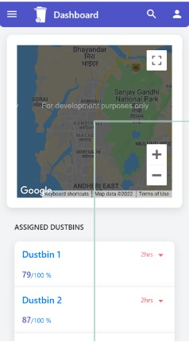

### Award and Recognization

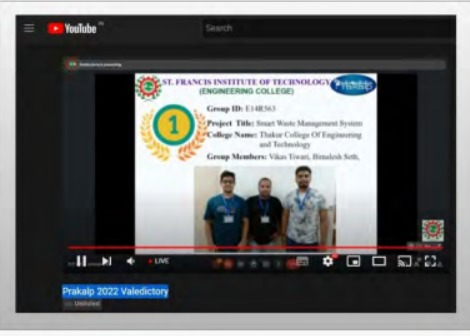
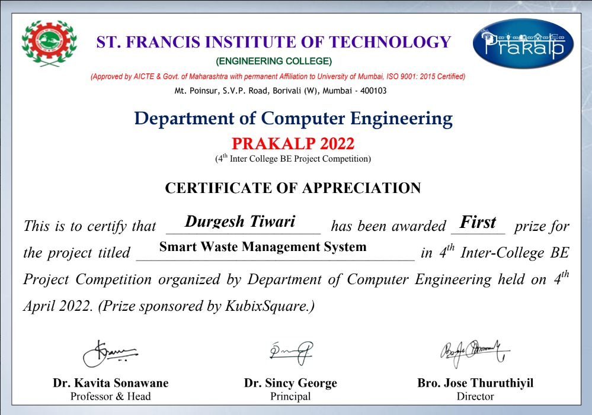

## Contributer's is Always welcome 
- if anyone want to collaborate feel free to contact me or message me on linkedin    :)   
## Regards & Welcome  

[Durgesh Tiwari](https://www.linkedin.com/in/durgesh98/)
